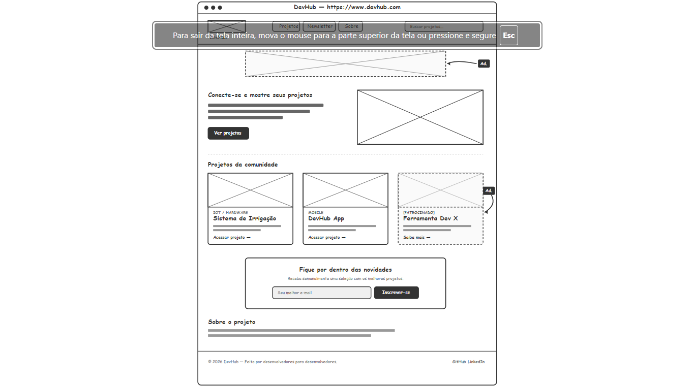
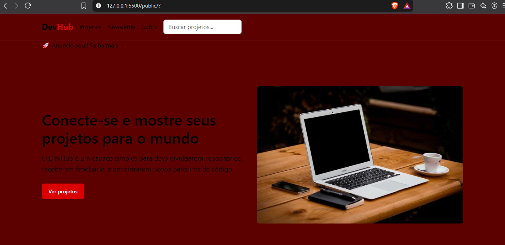

# DevHub

## 1. Dados básicos

**Nome:** Wallace Gabriel Moreira da Silva

**Matrícula:** 929805

**Proposta escolhida:** Proposta 1 — Pessoas e Produções

### Descrição do projeto

O DevHub é uma aplicação web voltada para a comunidade de desenvolvedores. A plataforma tem como objetivo permitir a apresentação e descoberta de projetos desenvolvidos por diferentes pessoas.

A entidade principal do projeto é o desenvolvedor, enquanto a entidade secundária são os projetos, estabelecendo uma relação entre as pessoas e suas produções.

## 2. Wireframe

## 3. Home-page

A home-page foi desenvolvida utilizando **HTML5, CSS3 e Bootstrap 5**, com foco em responsividade e adaptação para diferentes tamanhos de tela.

### Versão Desktop

### Versão Mobile

## 4. Responsividade com Bootstrap

Na segunda etapa do projeto, a home-page foi refatorada utilizando o framework **Bootstrap**, substituindo os recursos de responsividade anteriormente implementados diretamente com CSS.

Foram utilizados recursos como:

* Grid responsivo do Bootstrap;
* Classes `container`, `row` e `col`;
* Classes responsivas para diferentes tamanhos de tela;
* Classes de formulário;
* Botões responsivos;
* Classes utilitárias de espaçamento e alinhamento;
* Bootstrap via CDN.

A versão responsiva foi registrada no Git com a tag **v2.0**.

## 5. Tecnologias utilizadas

* HTML5
* CSS3
* Bootstrap 5
* Git
* GitHub
